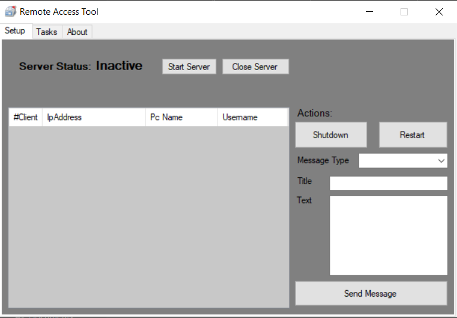
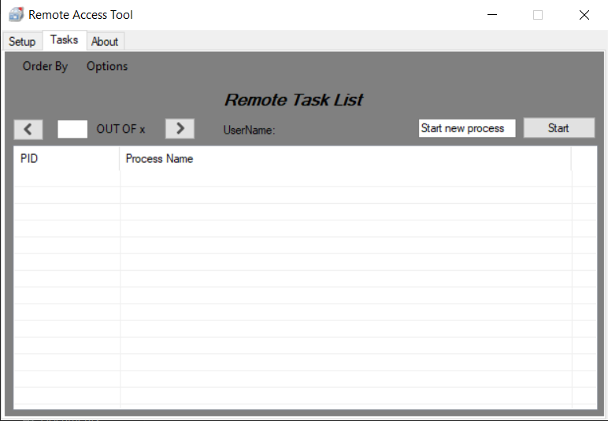

# Remote-Access-Tool
 A simple remote access tool with limited capabillities for legimate use

#### This rat was developed by Konstantinos Pap and it's powered by Pap Industries

This rat wasn't created for illegal usage but to help shutting down - restarting- sending messages - stoping processes - starting processes on another computer

## Help

In order to shutdown a process at the Tasks menu you need to check the check box at the left of the process you want to kill. If there are multiple 
processes of the same program like chrome, in order to kill it you need to kill one process at a time because some processes recall themselves before they die, therefore nothing happens.

When you start a process make sure to type the .exe extention of the program you want to initialize!
The bug where the clients could not reconnect to the server has been resolved.
Best practice is to complete all the actions you want before you shutdown the server

